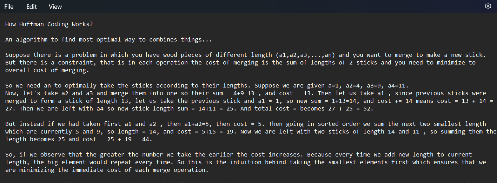

# This repository comes under hacktoberfest 2024
### NOTE : hacktoberfest-accepted label will be added once the PR is merged
<b>For contribution :</b>
<ol>
  <li>Create a fork of repository</li>
  <li>Look for existing issues or create a new issue if you want to add feature or any modification</li>
  <li>Once the the issue is assigned to you, create a PR to merge the changes</li>
</ol>

# To Contribute to Articles
<ol>
  <li>Raise a new issue about the article</li>
  <li>If it is assigned to you, create a new PR for a txt file</li>
  <li>For the txt file format look below</li>
</ol>

# To submit a txt file for contributing an article
<ol>
  <li>First line contains the topic of the article</li>
  <li>Leave a line and then enter the description (a small description which appear on the list of articles)</li>
  <li>Leave another line, then start writing your article</li>
  <li>Note that to separate the paragraphs in article (on website), you again need to leave an empty line in the txt file</li>
</ol>

sample file below

