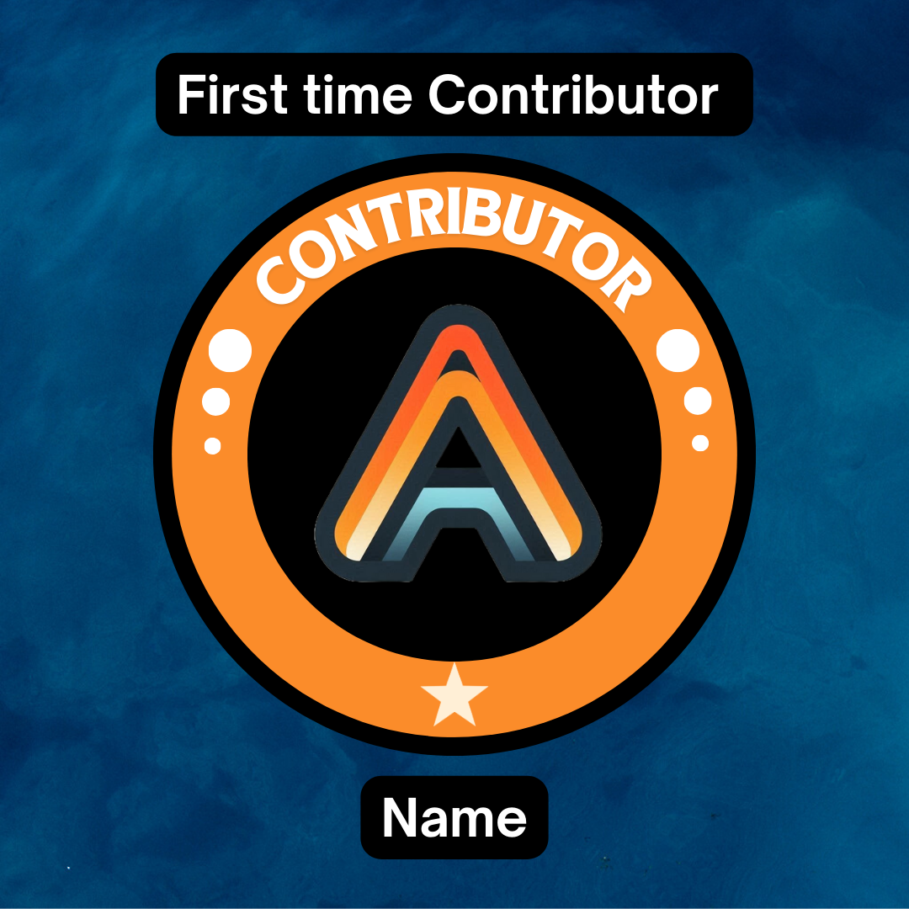

<!DOCTYPE html>
<html lang="en">
<head>
    <meta charset="UTF-8">
    <meta name="viewport" content="width=device-width, initial-scale=1.0">
</head>
<body>
    

        <h1>UniAlgo</h1>
        <h2>📢 News</h2>
        <i>🚧 Adding a separate webpage to enter data anywhere from the world + github OAuth</i>
        <h2>🌐 Overview</h2>
        
<b>UniAlgo</b> is a platform designed to help users understand <b>competitive programming (CP)</b>. It features a curated collection of unique CP concepts, algorithms, and articles that take time and effort to master.

        <h2>🌟 Key Features:</h2>
        <ul>
            <li>📚 Articles for learning competitive programming.</li>
            <li>🖼️ Frontend developed using HTML, CSS, and JavaScript and user-friendly interface.</li>
            <li>🛠️ Backend built with Python and Firebase for seamless performance.</li>
            <li>✉️ Mailing system keep users updated, with ongoing improvements.</li>
            <li>🗂️ Algorithm Implementations available in the master/Algorithms folder for you to explore.</li>
            <li>🔒 Content in Articles is copyrighted,but the source code is open for contributions.</li>
        </ul>
        <h2>🔔 Stay Updated!</h2>
        <h4>To get latest notification for newly added articles you need to sign in to UniAlgo</h4>
        

        <h2>🚀 Future Release</h2>
        
We are shifting from our original way of creating individual HTML files to using our own server-side rendering for articles.💻 This shift will enhance performance and scalability.

        
💡This work may take time, If you have any suggestions or ideas regarding the server setup, feel free to raise an issue with the label 'server'.

        

        <h2>🤝 How to Contribute?</h2>
        <b>What can you contribute to UniAlgo?</b>
        <ul>
            <li>🧠 Solve coding problems listed in the issues or raise new ones.</li>
            <li>📝 Contribute new Articles related to competitive programming.</li>
            <li>💻 From a developer's point of view, we aim to use a simple tech stack that’s easy for most contributors to understand.</li>
        </ul>
        <h4>For Hacktoberfest and contribution realated queries please check out our <b>CONTRIBUTION.md</b></h4>
        <h2>🎁 Swags & Recognition</h2>
        
We respect out contributors and to recognize their work, the contributors will be awarded <b>Digital Badges</b> based on their contribution which they can showcase on their social profiles 🏅

        <b>⚠️  Note: We are currently developing the platform to deliver badges. 🕒 Please be patient as it may take some time to receive them.</b>
        
 

         
        <ol>
            <li>⭐ First-time contributors will receive a single star badge.</li>
            <li>⭐⭐⭐ Contributors with 3 successful MRs will be awarded a three-star badge.</li>
            <li>🏆 For more than 5 successful MRs, contributors will receive a trophy badge.</li>
        </ol>
        

    <footer>
        
&copy; 2024 Unialgo. All rights reserved.

    </footer>
</body>
</html>
